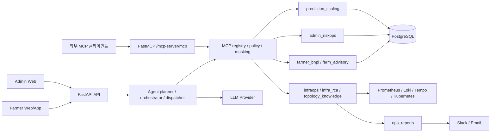
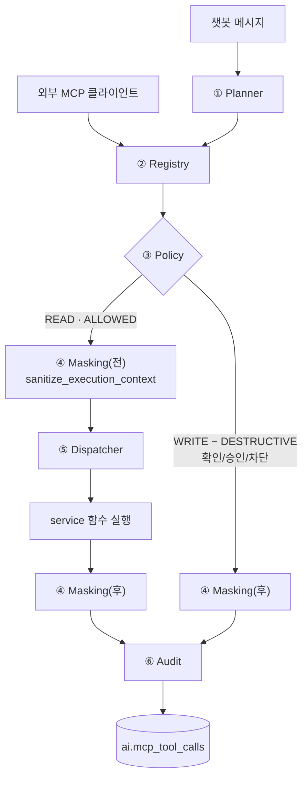
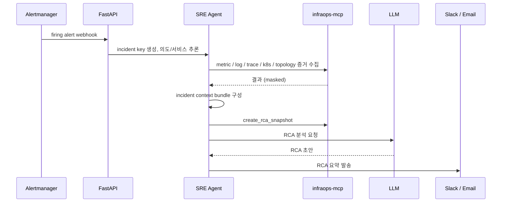
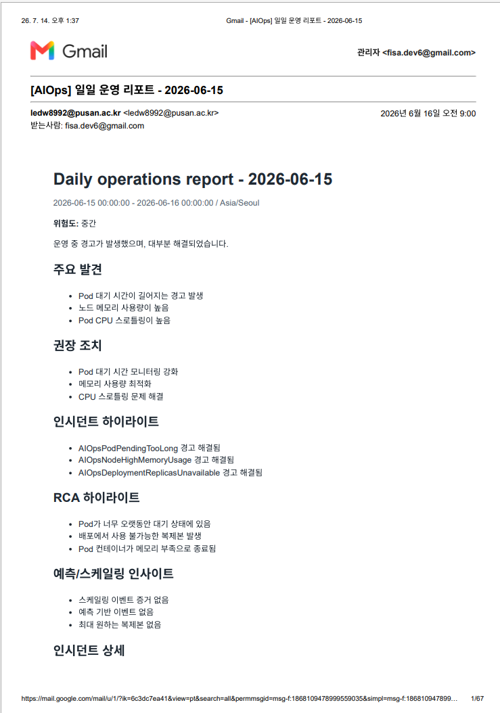
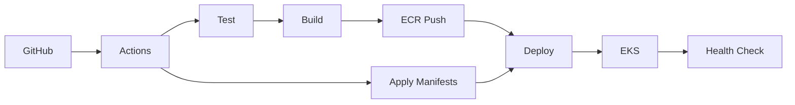

# 🌱 콩콩팥팥 · MCP AIOps Backend

> 농업 데이터 기반 **BNPL 플랫폼**에 붙는 **MCP 기반 AIOps 백엔드**입니다.
> 농민 BNPL 상담, 관리자 RiskOps, SRE 장애 분석(RCA)을 하나의 **Agent → MCP Tool** 계층으로 연결해 챗봇, Copilot, RCA, 예측 기반 스케일링 점검, 운영 리포트를 제공하는 FastAPI/FastMCP 멀티도메인 서비스입니다.


---

## 목차

1. [프로젝트 개요](#overview)
2. [모듈/실행 경로 구성](#modules)
3. [핵심 시나리오](#workflow)
4. [핵심 기능](#features)
5. [테스트](#test-scenarios)
6. [CI/CD](#cicd)
7. [기술 스택](#tech-stack)
8. [디렉터리 구조](#directory)
9. [관련 문서](#docs)
10. [관련 레포지토리](#repositories)

---

<a id="overview"></a>

## 📌 1. 프로젝트 개요

농업인은 파종·생육·수확 시점에 따라 소득과 문의가 몰리고, 파종기·수확기·상환일에는 신청/결제/상환 요청과 함께 운영 트래픽도 급증합니다. 이 저장소는 단순한 BNPL API 서버가 아니라, 이런 상황에서 발생하는 **사용자 문의, 관리자 의사결정, 장애 조사, 운영 보고를 AI Agent가 도와주는 백엔드**입니다.

LLM Agent가 데이터베이스나 인프라 API를 직접 호출하면 실행 범위를 통제하기 어렵기 때문에, 모든 외부 동작을 **MCP Tool**로 감싸고 registry/policy로 "어떤 도구를, 어떤 권한으로, 어떤 입력에 대해 실행했는지"를 감사(audit)합니다.

### 핵심 목표

* 농민 BNPL 한도/상환/배송/농자재 추천 챗봇
* 관리자 신용 심사/연체/재해 리스크 Copilot
* Prometheus/Loki/Tempo/Kubernetes/Alertmanager 기반 SRE 장애 분석(RCA)
* 예측 모델 기반 오토스케일링 상태 점검(KEDA/HPA 비교)
* MCP registry/policy 기반 Tool 권한 통제와 감사 로그
* LLM 실행 이력, 승인 큐, 알림 이력의 완전한 추적성
* GitHub Actions → ECR → EKS 기반 배포

> 전체 프로젝트의 하이브리드 클라우드, 예측 기반 오토스케일링, Observability 구성은 [FISA-Agri-Pay 조직 프로필](https://github.com/FISA-Agri-Pay)을 참고하세요.

---

<a id="modules"></a>

## 🏗️ 2. 모듈/실행 경로 구성

단일 FastAPI 애플리케이션 안에 도메인별 서비스 모듈을 두고, 그 위에 Agent 계층과 MCP 계층을 얹은 구조입니다. Java 백엔드처럼 서비스가 컨테이너 단위로 쪼개져 있지는 않지만, 도메인 패키지(`src/aiops_platform/*`)로 책임을 분리했습니다.



| 모듈 | 기능 |
| --- | --- |
| `api/` | FastAPI 라우터 |
| `agent/` | planner, orchestrator, dispatcher |
| `mcp/` | MCP registry, policy, masking, audit, FastMCP 서버 |
| `farmer_bnpl/` | 농민 BNPL 신용/상환/장바구니/checkout service·repository·schema |
| `farm_advisory/` | 작물 캘린더/농자재 추천/리스크 시뮬레이션 |
| `admin_riskops/` | 관리자 심사 큐/연체/재해 리스크 service·repository·schema |
| `infraops/` | Prometheus/Loki/Tempo/ELK/Kubernetes/AWS observability client |
| `infra_rca/` | incident, RCA report, RCA job runner |
| `alertmanager_agent/` | Alertmanager webhook 기반 proactive RCA watcher |
| `prediction_scaling/` | 예측/실측 metric, scaling event, Slack watcher |
| `ops_reports/` | 운영 리포트 생성/조회/이메일 발송 |
| `llmops/` | LLM provider client, run history, prompt/audit |
| `topology_knowledge/` | 서비스 라우팅/의존성 topology 스냅샷 |
| `core/` | config, database, metrics |

---

<a id="workflow"></a>

## 🔁 3. 핵심 시나리오

```text
[농민 BNPL 상담]
사용자 질문 → Farmer Agent → credit/repayment/product MCP Tool 조회 → 답변 + UI card + tool-call history

[관리자 리스크 운영]
관리자 질문 → Admin Copilot → RiskOps/BNPL/overdue MCP Tool 조회 → 위험 요약 + 근거 payload + LLM run 저장

[SRE 장애 분석]
SRE 질문 또는 Alertmanager alert
 → 장애 의도/대상 서비스 추론
 → READ-only InfraOps Tool 계획
 → metric/log/trace/Kubernetes/topology 증거 수집
 → incident context bundle 및 RCA snapshot 생성
 → LLM RCA 분석
 → Slack/Email 알림 및 audit 기록
```

SRE Agent 자동 실행은 읽기 전용입니다. `scale_deployment`, `restart_pod`, `delete_pod`, `run_kubectl_exec`처럼 운영 상태를 바꾸거나 파괴적인 Tool은 자동 RCA 흐름에서 제외합니다.

---

<a id="features"></a>

## 🔍 4. 핵심 기능

<a id="mcp-architecture"></a>
<details>
<summary><strong> 4-1. MCP Tool Registry와 권한 정책</strong></summary>
<br>

모든 외부 동작(DB 조회, Prometheus/Loki 쿼리, Kubernetes API, 알림 발송 등)은 MCP Tool로 감싸고, registry와 policy가 실행 가능 여부를 판단합니다.

#### 설계 파이프라인 (6단계)

Tool 호출 하나가 실행되기까지 6단계를 거치도록 설계했습니다. 각 단계는 독립된 모듈이 책임지며, 어느 단계에서 막히든 다음 단계로 넘어가지 않고 그 시점 상태 그대로 감사(audit)됩니다. 챗봇 Agent 경로와 외부 MCP 클라이언트 경로는 진입점만 다르고, 2단계(Registry)부터는 같은 파이프라인을 공유합니다.



| 단계 | 책임 | 코드 |
| --- | --- | --- |
| 1. Planner | 사용자 메시지를 도메인 의도로 분류하고 Tool 실행 계획 세움 | [`agent/planner.py`](src/aiops_platform/agent/planner.py) — `LlmAgentPlanner` |
| 2. Registry | 계획된 Tool이 실제로 등록돼 있는지 확인 (없으면 즉시 실패) | [`mcp/registry.py`](src/aiops_platform/mcp/registry.py) — `list_mcp_tools`, `resolve_registered_tool` |
| 3. Policy | 권한 등급을 실행 가능 여부로 변환 | [`mcp/policy.py`](src/aiops_platform/mcp/policy.py) — `resolve_tool_policy` |
| 4. Masking | 개인·금융·인증 정보를 실행 전/후 두 지점에서 마스킹함 | [`agent/dispatcher.py`](src/aiops_platform/agent/dispatcher.py) — `sanitize_execution_context`, [`mcp/masking.py`](src/aiops_platform/mcp/masking.py) — `mask_payload` |
| 5. Dispatcher | Tool 이름을 실제 service 함수로 연결 및 실행 | [`agent/dispatcher.py`](src/aiops_platform/agent/dispatcher.py) — `McpToolDispatcher.execute` |
| 6. Audit | 요청·응답·LLM run을 감사 로그로 남김 | [`mcp/audit.py`](src/aiops_platform/mcp/audit.py) — `McpToolAuditService`, [`orchestration/service.py`](src/aiops_platform/orchestration/service.py) — `_persist_agent_tool_result` |

AIOps 설계에서의 고려사항:

- **3단계(Policy)에서 조기 차단** : `WRITE` 이상 권한은 정책상 `ALLOWED`가 아니면 5단계(Dispatcher)까지 가지 않고 `dry_run`/preview 응답을 즉시 반환합니다. `DESTRUCTIVE`는 애초에 실행 경로 자체가 없습니다.
- **Masking은 두 번 진행** : 실행 전 `sanitize_execution_context()`는 `access_token`/`password`류 키를 아예 제거해 service 함수에 전달하지 않고, 실행 후 `mask_payload()`는 저장/응답용으로 더 넓은 키워드 목록을 마스킹합니다. 차단·실패 응답도 동일하게 마스킹을 거칩니다.
- **Audit은 성공 여부와 무관하게 남는다** : 3단계에서 막힌 요청(`APPROVAL_REQUIRED`, `BLOCKED`)도, 5단계에서 실패한 요청(`FAILED`)도 모두 감사 기록으로 남아 `/mcp/tool-calls`에서 조회할 수 있습니다.

#### 등록된 MCP 서버

| Server | 역할 |
| --- | --- |
| `farmer-bnpl-mcp` | BNPL 신용/상품/장바구니/checkout |
| `farm-advisory-mcp` | 작물 캘린더/농자재 추천/리스크 시뮬레이션 |
| `admin-riskops-mcp` | 심사 큐/연체/재해 리스크/알림 |
| `infraops-mcp` | Prometheus/Loki/Tempo/ELK/Kubernetes/AWS/RCA |
| `prediction-scaling-mcp` | 예측/실측 metric, scaling event, KEDA/HPA 상태 |

`infraops-mcp`의 ELK/Kafka/Batch Tool은 `INFRAOPS_ELK_ENABLED`, `INFRAOPS_KAFKA_ENABLED`, `INFRAOPS_BATCH_ENABLED` 환경변수로 노출 여부를 켜고 끌 수 있습니다. 전체 Tool 목록은 `GET /mcp/tools?server_name=...`로 조회할 수 있습니다.

#### 권한과 정책

| Permission | 승인 정책 | 실행 정책 | 동작 |
| --- | --- | --- | --- |
| `READ` | 불필요 | 즉시 실행 | 결과를 바로 반환 |
| `WRITE` | 사용자 확인 | 확인 전까지 차단 | dry-run/preview payload 반환 |
| `USER_CONFIRMED_WRITE` | 사용자 확인 | 확인 전까지 차단 | 예: `create_bnpl_checkout` |
| `OPS_WRITE` | 운영자 승인 | 승인 전까지 차단 | 예: `scale_deployment`, `restart_pod` |
| `DESTRUCTIVE` | 항상 차단 | 항상 차단 | 예: `delete_pod`, `run_kubectl_exec` (실행 자체 불가) |

SRE Copilot에서 `create_rca_snapshot` Tool은 특별 취급됩니다. `AgentOrchestrator`는 이 호출을 뒤로 미뤄, 같은 턴에서 먼저 수집한 metric/log/trace/Kubernetes 결과를 `context_bundle`로 묶어 함께 전달한 뒤 실행합니다.

관련 코드:

* [`mcp/registry.py`](src/aiops_platform/mcp/registry.py)
* [`mcp/policy.py`](src/aiops_platform/mcp/policy.py)
* [`mcp/server.py`](src/aiops_platform/mcp/server.py)
* [`agent/dispatcher.py`](src/aiops_platform/agent/dispatcher.py)
* [`agent/orchestrator.py`](src/aiops_platform/agent/orchestrator.py)

</details>

<a id="farmer-agent"></a>
<details>
<summary><strong>4-2. Farmer BNPL Agent</strong></summary>
<br>

농민 사용자가 "이번 달 상환해야 할 금액과 남은 한도를 알려줘"라고 물으면 Farmer 챗봇은 사용자 프로필, 신용 한도, 상환 일정, 연체 여부를 MCP Tool로 조회합니다. LLM은 조회 결과를 바탕으로 쉬운 문장으로 답변하고, 필요한 경우 배송 상태나 농자재 추천 카드까지 함께 반환합니다.

READ Tool 일부(`get_farmer_profile`, `get_user_credit_limit`, `search_products` 등)는 `McpToolDispatcher`에서 15초~300초 TTL의 in-memory 캐시를 적용해 같은 세션의 반복 조회 비용을 줄입니다.

관련 코드:

* [`api/farmer.py`](src/aiops_platform/api/farmer.py)
* [`farmer_bnpl/service.py`](src/aiops_platform/farmer_bnpl/service.py)
* [`agent/dispatcher.py`](src/aiops_platform/agent/dispatcher.py) — `FARMER_BNPL_TOOL_CACHE_TTL_SECONDS`

</details>

<a id="admin-copilot"></a>
<details>
<summary><strong>4-3. Admin RiskOps Copilot</strong></summary>
<br>

관리자가 "연체 위험이 높은 고객과 재해 리스크 영향도를 요약해줘"라고 요청하면 Admin Copilot은 심사 큐, BNPL 요약, 연체 요약, BSS 이력, 재해 시뮬레이션 도구를 조합합니다. 결과는 관리자 화면에서 바로 확인할 수 있는 요약과 근거 데이터로 남습니다.

관련 코드:

* [`api/admin.py`](src/aiops_platform/api/admin.py), [`api/admin_risk.py`](src/aiops_platform/api/admin_risk.py)
* [`admin_riskops/service.py`](src/aiops_platform/admin_riskops/service.py)

</details>

<a id="sre-rca"></a>
<details>
<summary><strong>4-4. SRE 장애 분석과 RCA</strong></summary>
<br>

SRE가 "결제 서비스 5xx 원인 봐줘"라고 묻거나 Alertmanager가 firing alert를 보내면 SRE Agent는 서비스, namespace, alert 유형을 추론합니다. 이후 Prometheus metric, Loki log, Kubernetes event, service endpoint, topology knowledge, 이전 RCA 이력을 READ-only Tool로 수집하고 RCA 초안을 생성합니다.



`execute=true`면 READ 전용 증거 수집을 실제로 실행하고, `execute=true&notify=true`면 Slack/Email 알림 outbox까지 기록합니다. 실제 원격 조치(재시작/스케일/삭제/exec)는 자동 흐름에서 항상 비활성 상태입니다.

관련 코드:

* [`api/sre.py`](src/aiops_platform/api/sre.py), [`api/alertmanager.py`](src/aiops_platform/api/alertmanager.py), [`api/rca.py`](src/aiops_platform/api/rca.py)
* [`alertmanager_agent/service.py`](src/aiops_platform/alertmanager_agent/service.py), [`alertmanager_agent/watcher.py`](src/aiops_platform/alertmanager_agent/watcher.py)
* [`infra_rca/service.py`](src/aiops_platform/infra_rca/service.py)
* 세부 권한/감사 규칙: [`docs/sre-agent-security-policy.md`](docs/sre-agent-security-policy.md)

</details>

<a id="prediction-scaling"></a>
<details>
<summary><strong>4-5. Prediction Scaling 점검</strong></summary>
<br>

`ai-prediction-model`이 산출한 GRU 예측 metric을 PostgreSQL에서 읽어와 실측 metric, 오차, HPA/KEDA 상태와 비교합니다. `PREDICTION_SCALING_WATCHER_ENABLED=true`면 주기적으로 편차를 점검해 Slack으로 위험도별 알림을 보냅니다.

관련 코드:

* [`api/prediction_scaling.py`](src/aiops_platform/api/prediction_scaling.py)
* [`prediction_scaling/service.py`](src/aiops_platform/prediction_scaling/service.py), [`prediction_scaling/watcher.py`](src/aiops_platform/prediction_scaling/watcher.py)

</details>

<a id="masking-audit"></a>
<details>
<summary><strong>4-6. Masking과 Audit</strong></summary>
<br>

* `agent/dispatcher.py`의 `sanitize_execution_context()`는 Tool 실행 **전** payload에서 `access_token`, `api_key`, `authorization`, `password`, `secret`, `token` 키를 완전히 제거합니다.
* `mcp/masking.py`의 `mask_payload()`는 저장/응답용으로 `password`, `passwd`, `secret`, `token`, `api_key`, `apikey`, `authorization`, `access_key`, `refresh_key`, `private_key`가 포함된 키를 `***MASKED***`로 치환합니다.
* Topology knowledge Tool은 `masking_level=secrets_only|infrastructure` 파라미터로 IP/CIDR/AWS 계정 ID/ARN까지 추가로 가릴 수 있습니다.
* FastMCP 경로의 감사 기록은 DB 테이블 `ai.mcp_servers` / `ai.mcp_tools` / `ai.mcp_tool_calls`를 사용하며, 코드 레지스트리와 `server_name`/`tool_name`이 일치해야 기록이 성공합니다.
* Tool 호출 이력은 `GET /mcp/tool-calls`, `GET /mcp/tool-calls/{tool_call_id}`로 조회합니다.

관련 코드: [`mcp/masking.py`](src/aiops_platform/mcp/masking.py), [`mcp/audit.py`](src/aiops_platform/mcp/audit.py), [`models/mcp.py`](src/aiops_platform/models/mcp.py)

</details>

<a id="ops-reports"></a>
<details>
<summary><strong>4-7. Ops Reports</strong></summary>
<br>

RCA, prediction/scaling 요약, 운영 metric을 모아 일간/주간 리포트를 생성하고, 생성된 리포트를 HTML 이메일로 발송합니다. 1차 범위는 대시보드 UI 없이 API 조회와 이메일 발송으로 소비합니다.



`POST /reports/ops/{report_id}/send-email`로 실제 발송된 일간 리포트 이메일(Gmail 수신함) 예시입니다. 위험도와 요약, 주요 발견/권장 조치, Alertmanager 인시던트·RCA 하이라이트, 예측/스케일링 인사이트가 HTML 이메일 본문으로 그대로 전달되는 것을 확인할 수 있습니다. 스크린샷은 상단부만 캡처한 것이며, 실제 이메일에는 인시던트 상세(심각도·Alert·서비스·요약) 표가 이어집니다.

관련 코드:

* [`api/reports.py`](src/aiops_platform/api/reports.py)
* [`ops_reports/service.py`](src/aiops_platform/ops_reports/service.py), [`ops_reports/email_delivery.py`](src/aiops_platform/ops_reports/email_delivery.py), [`ops_reports/job_runner.py`](src/aiops_platform/ops_reports/job_runner.py)

</details>

---

<a id="test-scenarios"></a>

## ✅ 5. 테스트

본 프로젝트는 API 응답 형식뿐 아니라, MCP 권한 판정·masking·audit이 실제로 의도대로 동작하는지를 중심으로 테스트했습니다.

### 주요 검증 항목

| 구분 | 검증 내용 |
| --- | --- |
| MCP 권한/정책 | 권한 등급별 자동실행/확인/승인/차단 판정 |
| MCP Registry | Tool 목록 조회·필터링, ELK/Batch 노출 on/off |
| Masking/Audit | 민감값 마스킹, 감사 로그 기록 |
| Agent Planner/Dispatcher | 의도 분류부터 Tool 실행·캐시까지 계획-실행 흐름 |
| Farmer BNPL 챗봇 | 세션·tool-call 이력, 카드 응답, LLM 실패 fallback |
| Admin RiskOps Copilot | 심사·BNPL·연체 조회, 알림은 preview만 반환 |
| SRE / Alertmanager RCA | Alert 유형별 READ Tool 계획, RCA 근거 구성 |
| Prediction Scaling | 예측·실측 오차 |
| Ops Reports | 리포트 생성·이메일 발송, LLM 실패 처리 |
| LLMOps | LLM run/prompt 기록, 프롬프트 요구사항 검증 |


---

<a id="cicd"></a>

## 🚀 6. CI/CD

GitHub Actions 단일 워크플로(`.github/workflows/deploy.yml`)가 테스트부터 EKS 배포까지 처리합니다.



| 단계 | 역할 |
| --- | --- |
| `test` job | Postgres 16 service container + `tests/seed/ci_schema.sql`로 스키마 초기화 후 `pytest -ra -vv` 실행, 실패 시 로그 tail을 Job Summary에 기록 |
| Docker Build | `python:3.11-slim-bookworm` builder → `distroless/python3-debian12:nonroot` runtime 멀티스테이지, non-root 실행 |
| Amazon ECR | OIDC(`aws-actions/configure-aws-credentials`)로 역할을 assume해 이미지 push |
| Kubernetes 매니페스트 | `infra/k8s/{serviceaccount,rbac,configmap,service}.yaml`을 네임스페이스 치환 후 apply |
| Runtime Secret | `DATABASE_URL`, `LLM_API_KEY`, SMTP, Slack webhook 등을 GitHub Secrets에서 K8s Secret으로 생성 |
| 배포 | `infra/k8s/deployment.yaml`, `infra/k8s/ops-report-cronjobs.yaml` apply 후 `kubectl rollout status`로 대기 |
| Smoke Test | 배포 직후 `curlimages/curl` Pod로 `GET /health` 확인 |

---

<a id="tech-stack"></a>

## 🛠️ 7. 기술 스택

| 영역 | 스택 |
| --- | --- |
| Language / Framework | Python 3.11, FastAPI, FastMCP |
| Data | PostgreSQL 16, SQLAlchemy 2.0 |
| Observability | Prometheus, Loki, Tempo, Alertmanager |
| Kubernetes / AWS | Kubernetes API, AWS, ArgoCD |
| LLM | vLLM(Qwen3-32B) |
| Build / Container | Docker, Amazon ECR |
| CI/CD | GitHub Actions, Amazon EKS, kubectl |
| Test / Lint | pytest, ruff |
| Security | MCP permission/policy, Trivy |

---

<a id="directory"></a>

## 📂 8. 디렉터리 구조

```text
mcp-aiops-backend/
├─ src/
│  └─ aiops_platform/
│     ├─ api/                  FastAPI router
│     ├─ agent/                planner, orchestrator, dispatcher
│     ├─ mcp/                  MCP registry, policy, masking, audit, FastMCP server
│     ├─ farmer_bnpl/          농민 BNPL service/repository/schema
│     ├─ farm_advisory/        농업 조언 service/schema
│     ├─ admin_riskops/        관리자 RiskOps service/repository/schema
│     ├─ infraops/             observability/Kubernetes/infra client tools
│     ├─ infra_rca/            incident, RCA report, RCA job runner
│     ├─ alertmanager_agent/   Alertmanager 기반 proactive RCA watcher
│     ├─ prediction_scaling/   예측 metric, actual metric, scaling event, Slack watcher
│     ├─ ops_reports/          운영 리포트 생성, 조회, 이메일 발송
│     ├─ llmops/               LLM provider client, run history, prompt/audit
│     ├─ topology_knowledge/   서비스 라우팅/의존성 topology 스냅샷
│     └─ core/                 config, database, metrics
├─ docs/                       설계/연동 계약 문서
├─ infra/
│  ├─ k8s/                     EKS/Kubernetes manifests
│  ├─ docker/                  로컬 보조 인프라 예시
│  └─ grafana/                 Grafana datasource/dashboard json
├─ tests/                      unit/integration tests and seed fixtures
├─ Dockerfile
└─ pyproject.toml
```

---

<a id="docs"></a>

## 📄 9. 관련 문서

| 문서 | 내용 |
| --- | --- |
| [`docs/mcp-client-contract.md`](docs/mcp-client-contract.md) | 프론트엔드/API/MCP 연동 계약 |
| [`docs/erd.md`](docs/erd.md) | 공개 가능한 ERD와 데이터 관계 요약 |
| [`docs/configuration.md`](docs/configuration.md) | 로컬/운영 환경변수와 LLM provider 설정 |
| [`docs/deployment.md`](docs/deployment.md) | Docker, Kubernetes, GitHub Actions 배포 흐름 |
| [`docs/sre-agent-security-policy.md`](docs/sre-agent-security-policy.md) | SRE Agent 권한, masking, audit 정책 |
| [`docs/vessl-vllm-prometheus-scrape.md`](docs/vessl-vllm-prometheus-scrape.md) | VESSL/vLLM Prometheus scrape 메모 |
| [`infra/docker/postgres/init/README.md`](infra/docker/postgres/init/README.md) | 로컬 PostgreSQL init script 관리 원칙 |

---

<a id="repositories"></a>

## 🔗 10. 관련 레포지토리

| 레포 | 설명 |
| --- | --- |
| [`back-end`](https://github.com/FISA-Agri-Pay/back-end) | 금융 핵심 도메인 백엔드 |
| [`front-end`](https://github.com/FISA-Agri-Pay/front-end) | 사용자용 웹앱 프론트엔드 |
| [`front-end-admin`](https://github.com/FISA-Agri-Pay/front-end-admin) | 관리자용 웹 프론트엔드 |
| [`ai-prediction-model`](https://github.com/FISA-Agri-Pay/ai-prediction-model) | 시계열 예측 모델 · 오토스케일링 정책 |
| [`infra`](https://github.com/FISA-Agri-Pay/infra) | Terraform 기반 IaC · 운영 스크립트 |
| [`git-ops`](https://github.com/FISA-Agri-Pay/git-ops) | ArgoCD GitOps 배포 매니페스트 |
